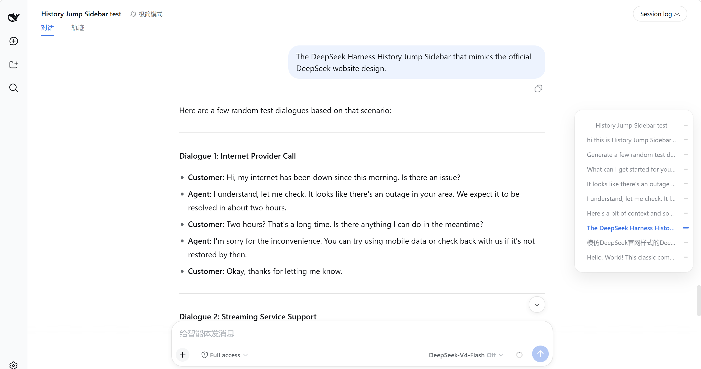

# dsh-turn-rail

[English](README.md) | 中文

给 DeepSeek Harness Web 界面加的右侧会话轮次导航条，还原 DeepSeek 官方页面样式：

- 默认是右侧边缘中部的 34px 小竖条，每条用户消息对应一个灰色小横条，当前轮次是蓝色并拉长；圆角毛玻璃底条为可选，默认关闭，见下方开关说明。
- 鼠标悬停/键盘聚焦后展开为 240px 浮层，显示每轮用户消息文字。
- 上下滚动聊天区时高亮自动跟随（scrollspy）。
- 打开会话后自动逐页加载历史，右侧导航条会列出全部历史轮次，不需要手动上滑。

## 界面截图



## 一键安装

先确保你已经安装并运行过 DeepSeek Harness Web（`npx @deepseek-ai/dsh web` 或源码 `pnpm dsh web`），并确保命令行里有 `dsh` 和 `pnpm`。

然后执行：

```sh
dsh plugin --profile web add github:Luoji-Yuli/dsh-turn-rail
```

执行完会显示 `+ @deepseek-ai/dsh-turn-rail ...`，表示安装成功。

如果 `dsh web` 正在运行，重启后刷新页面。

本地目录安装（开发调试用）：

```sh
dsh plugin --profile web add link:./dsh-turn-rail
```

## 启动

```sh
dsh web
```

然后在浏览器打开 `http://127.0.0.1:3080`，**Ctrl + F5 强制刷新**一次。

打开任意一个包含至少 2 条用户消息的会话，即可在页面右侧边缘中部看到导航条。

## 毛玻璃底条开关

收起状态下的圆角毛玻璃底条**默认关闭**。

1. 打开 DeepSeek Harness Web，进入 **设置 → 通用设置**。
2. 找到 **导航条毛玻璃底条** 这一行。
3. 打开开关：浅色和深色模式下都显示圆角毛玻璃底条。
4. 关闭开关：两种模式下都不显示底条，只显示灰/蓝小横条。

## 卸载

```sh
dsh plugin --profile web remove @deepseek-ai/dsh-turn-rail
```

## 目录结构

```
dsh-turn-rail/
  package.json          # dsh.bundle + dsh.client 双声明
  cordis.patch.yml      # 往 web profile 插入一行插件配置
  docs/
    screenshot.png      # 界面截图
  lib/
    index.js            # 主机侧空插件（供 loader 加载）
    client.js           # 浏览器侧打包产物（已构建好，开箱即用）
    types/              # TypeScript 类型
  src/                  # 插件源码（浏览器侧组件 + 主机侧空插件）
  tests/                # 组件单测
  tsconfig.json         # 在 deepseek-harness 主仓库内构建时使用的 TS 配置
  tsdown.config.ts      # 在 deepseek-harness 主仓库内构建时使用的打包配置
```

## 开发者：从源码重新构建

本仓库自带构建好的 `lib/client.js`，普通安装不需要构建。

如果你改了 `src/` 下的源码，需要回到 `deepseek-harness` 主仓库，把对应文件同步到：

```
packages/client/ui-turn-rail/
```

然后执行：

```sh
pnpm install
pnpm --filter @deepseek-ai/dsh-turn-rail run bundle
```

最后把新生成的 `lib/client.js` 提交回本仓库。
